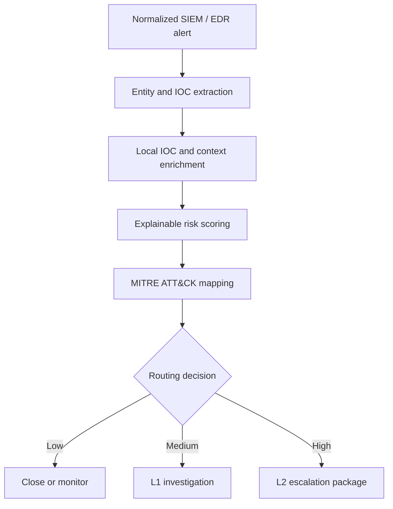

# SOC L1 Alert Triage Automation

[](https://github.com/krishnajith-stack/krishnajith-cybersecurity-portfolio/actions/workflows/soc-triage-test.yml)
[](https://krishnajith-stack.github.io/krishnajith-cybersecurity-portfolio/soc-l1-alert-triage-automation/)
[](https://krishnajith-stack.github.io/krishnajith-cybersecurity-portfolio/)

A transparent Python automation project that helps a SOC L1 analyst normalize an alert, enrich its indicators, calculate an explainable risk score, map observed behavior to MITRE ATT&CK, recommend next actions, and route the case for closure, investigation, or L2 escalation.

> Portfolio lab project using synthetic data. It does not claim autonomous incident response and does not replace analyst validation.

## Live Project

- [Open interactive triage demo](https://krishnajith-stack.github.io/krishnajith-cybersecurity-portfolio/soc-l1-alert-triage-automation/)
- [Read the implementation guide](docs/IMPLEMENTATION_GUIDE.md)
- [Inspect a generated L2 escalation report](evidence/INC-2026-001.md)
- [View sample alerts](samples/)
- [Review automated tests](tests/test_engine.py)

## Why I Built It

SOC analysts often spend time repeating the same early-stage tasks: checking basic context, validating indicators, estimating risk, recording evidence, and deciding whether an alert should be escalated. This project automates those repeatable steps while keeping the decision logic visible and preserving human ownership of containment and closure.

## Workflow



## What the Automation Does

| Stage | Automated task | Output |
| --- | --- | --- |
| Validate | Checks required fields and severity values | Rejected malformed alerts |
| Normalize | Uses one vendor-neutral alert schema | Consistent alert context |
| Enrich | Matches IPs, domains, and hashes against local IOC and allowlists | Evidence and tags |
| Correlate | Detects authentication, PowerShell, identity, and credential-access patterns | Behavioral findings |
| Score | Adds transparent weights for severity, asset importance, privilege, IOC reputation, and behavior | Risk score from 0–100 |
| Map | Links supported behaviors to ATT&CK techniques | Technique ID and name |
| Route | Applies thresholds and confirmed-malicious logic | P1–P4 and disposition |
| Report | Produces machine-readable JSON and analyst-readable Markdown | Evidence package for ticketing |

## Demonstrated Scenarios

| Scenario | Score | Result | ATT&CK |
| --- | ---: | --- | --- |
| Encoded PowerShell + malicious IP | 100 | Escalate to L2, P1 | T1059.001 |
| Privileged brute force + suspicious IP | 95 | Escalate to L2, P1 | T1110 |
| Impossible travel | 60 | Analyst investigation, P3 | T1078 |
| Approved vulnerability scanner | 0 | Close as benign, P4 | None |

## Run Locally

Requirements: Python 3.10 or newer. The engine has no third-party runtime dependencies.

```bash
git clone https://github.com/krishnajith-stack/krishnajith-cybersecurity-portfolio.git
cd krishnajith-cybersecurity-portfolio/soc-l1-alert-triage-automation
python -m venv .venv
```

Activate the virtual environment:

```bash
# Windows PowerShell
.venv\Scripts\Activate.ps1

# macOS / Linux
source .venv/bin/activate
```

Run immediately with no package installation:

```bash
python triage.py --input samples/alert-powershell.json
```

The command writes a JSON result and Markdown incident report to `reports/`.

Optional editable installation for development:

```bash
python -m pip install -e .
soc-triage --input samples/alert-powershell.json
```

## Test the Project

```bash
python -m unittest discover -s tests -v
```

GitHub Actions runs the same tests on every push and pull request.

## Risk Model

The model is intentionally simple enough to explain during an interview:

- Source severity: 0–55 points
- Asset criticality: 0–20 points
- Privileged identity: 15 points
- Suspicious/malicious IOC: 15/30 points
- High-volume authentication failures: 10–20 points
- Encoded or in-memory PowerShell: 25 points
- Credential-access evidence: 30 points
- Identity anomalies or MFA abuse: 25 points
- Approved benign activity and allowlists reduce the score

Routing thresholds:

- `70–100`: escalate to L2
- `40–69`: L1 analyst investigation
- `20–39`: monitor and document
- `0–19`: close as benign only when the context supports closure

A confirmed malicious IOC forces escalation even if the total score is below 70.

## Project Structure

```text
.
├── src/soc_triage/          # Python triage engine, CLI, and report generator
├── config/indicators.json   # Synthetic IOC and allowlist data
├── samples/                 # Four sanitized alert scenarios
├── tests/                   # Unit tests for scoring and routing
├── docs/                    # GitHub Pages demo and implementation guide
├── portfolio/               # Integration snippet for the main portfolio
└── .github/workflows/       # CI tests and Pages deployment
```

## Security and Privacy

- All names, domains, addresses, indicators, and alerts are synthetic.
- No credentials or API keys are needed.
- TEST-NET/example address ranges are used for portfolio-safe demonstrations.
- External reputation services are deliberately excluded from the offline demo.
- Production integrations should store secrets in a managed vault and follow API rate limits, data-handling requirements, and change control.

## Production Extension: Microsoft Sentinel

The current build is platform-neutral and free to run. A production version could receive a Sentinel incident through an Azure Logic App, normalize the payload, perform approved enrichment, write the result back to the incident, add tags, and assign or escalate the incident. Before auto-closing or containing anything, use approval controls and test the workflow against non-production data.

See [Implementation Guide](docs/IMPLEMENTATION_GUIDE.md) for the phased Sentinel design.

## Skills Demonstrated

SOC alert triage · Python automation · SIEM/EDR workflows · IOC enrichment · MITRE ATT&CK mapping · risk-based prioritization · incident documentation · escalation logic · unit testing · GitHub Actions · security-by-design

## Author

**Krishnajith P U**  
Cybersecurity & Vulnerability Management Lead | Azure Security | Security Operations  
[Portfolio](https://krishnajith-stack.github.io/krishnajith-cybersecurity-portfolio/) · [GitHub](https://github.com/krishnajith-stack)
